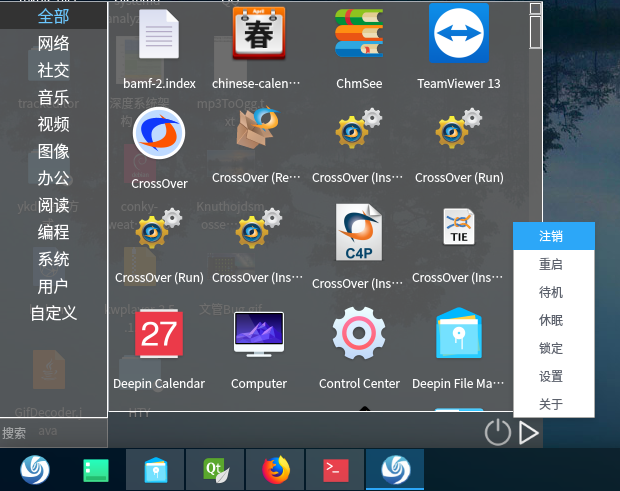

# Qt 海天鹰开始菜单
Linux 系统基于 Qt5 的开始菜单，显示 /usr/share/applications 目录所有文件，可以搜索过滤，可以关机、注销、重启、锁定等。  
已编译好的 HTYStartMenu 程序适用 64 位 Linux 系统 Qt5 环境，双击运行，其他版本自行编译。  

  

### 2.0 （2018-04）  
使用 QListWidget + QFileInfoList 重写。  
优点：  
1.可以显示图标；  
2.可以分类。

### 1.0 （2017-03）  
使用 QListView + QFileSystemModel 设计。  
缺点：  
1.不能显示图标;  
2.不能自动分类。